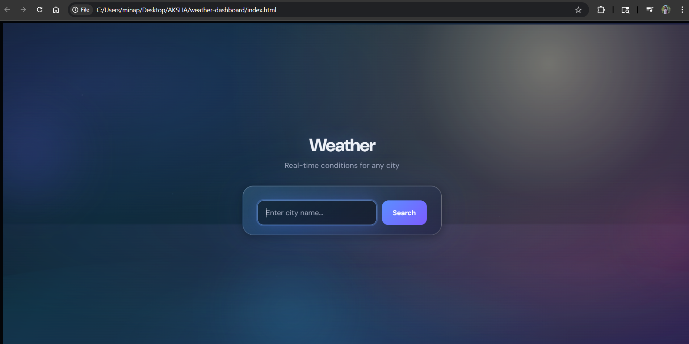
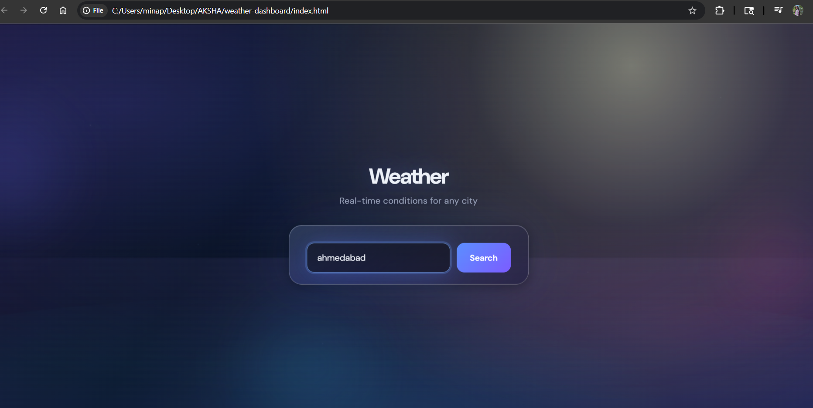
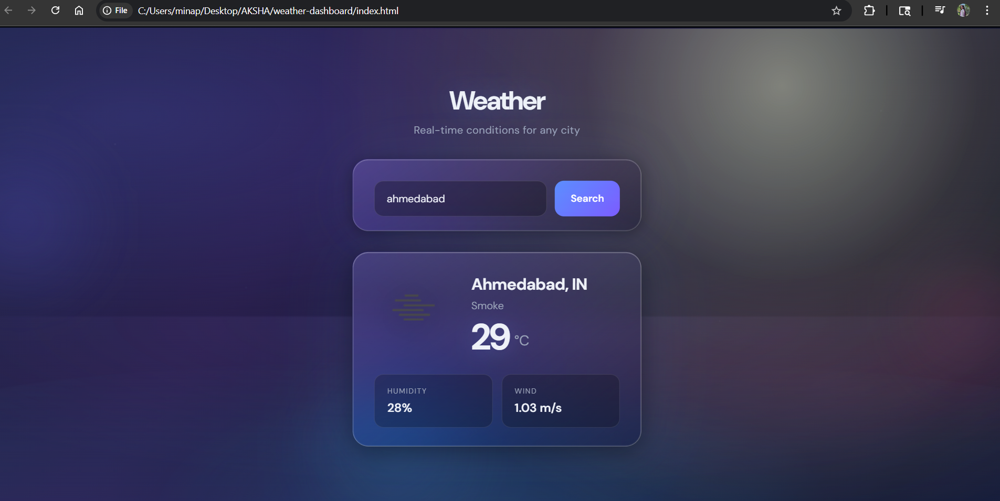
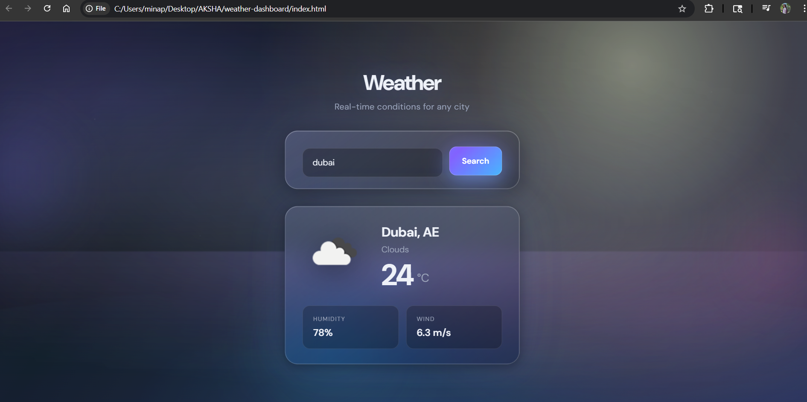

# 🌦️ Weather Dashboard

A modern, visually rich, and interactive weather dashboard that provides real-time weather data for any 
city using the OpenWeatherMap API. This project focuses on clean UI, smooth animations, and dynamic background 
effects based on weather conditions.

---

## 🚀 Features

- 🔍 Search weather by city name  
- 🌡️ Real-time temperature in Celsius  
- ☁️ Weather condition display (Clear, Clouds, Rain, etc.)  
- 💧 Humidity and 🌬️ wind speed  
- 🌐 Dynamic weather icons  
- 🎨 Animated background based on weather conditions  
- 🌈 Glassmorphism UI with modern design  
- 💾 Saves last searched city using localStorage  
- ⚠️ Error handling (invalid city / API issues)  
- ⏳ Loading spinner while fetching data  
- 🖱️ Smooth parallax animation effect  

---

## 🧱 Tech Stack

- HTML  
- CSS (Advanced animations + Glass UI)  
- JavaScript  
- OpenWeatherMap API  

---

## 📸 Preview

  
  
  


---

## ⚙️ How to Run

1. Clone this repository  
2. Open the project folder  
3. Open `script.js` file  
4. Replace API key:

```javascript
const API_KEY = "YOUR_OPENWEATHERMAP_API_KEY";```


5. Open `index.html` in your browser  

---

## 👤 Author

**Aksha Minapara**  
Frontend Developer | Python Learner  